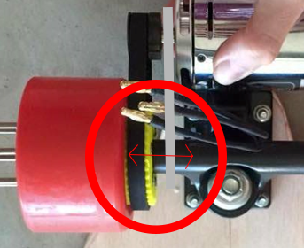
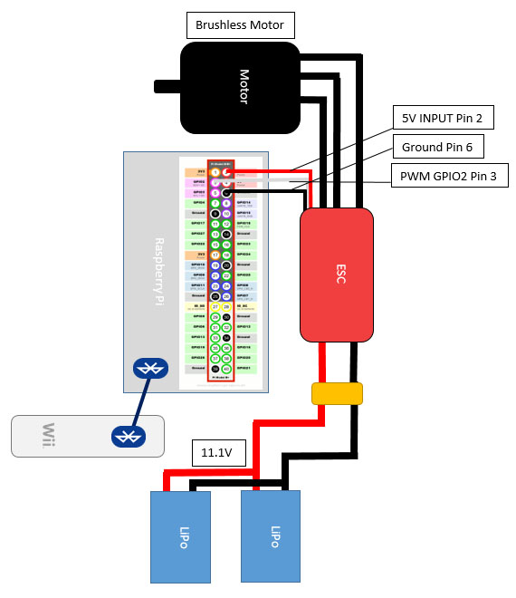

====================================
**PiSkate** – Raspberry Pi controlled electric skateboard 

This is an overview of the software/hardware for the PiSkate project

## Parts

**Electronic Parts:**

| Part              | Link                                                                                                              |Cost AUD   |
| -------------     |-------------                                                                                                      | -----:    |
| Motor             |http://www.hobbyking.com/hobbyking/store/__18184__Turnigy_Aerodrive_SK3_6374_149kv_Brushless_Outrunner_Motor.html  |$109       | 
| VESC              |http://vedder.se/2015/01/vesc-open-source-esc/                                                                     |$100       |
| ESC*              |http://www.hobbyking.com/hobbyking/store/__2165__TURNIGY_Plush_40amp_Speed_Controller_w_BEC.html                   |$30        |
| Pi 3              |http://au.element14.com/raspberry-pi/raspberrypi-modb-1gb/raspberry-pi-3-model-b/dp/2525226                        |$56        |
|2 x LiPo's         |http://www.hobbyking.com/hobbyking/store/__7635__ZIPPY_Flightmax_2200mAh_3S1P_30C.html                             |2 x $18.37 | 
|Parallel Harness   |http://www.hobbyking.com/hobbyking/store/uh_viewitem.asp?idproduct=10265                                           |$3.16      |
|Wii Remote         |You should be able to get these used on ebay for under $30                                                         |<$30       |
|**Total**          |                                                                                                                   |**$330**   |
**Note:** My board at the moment is not using the VESC but instead a makeshift 40AMP ESC this limits the speed and power of the motor.

**Hardware Parts:**

I did not add the skateboard parts to this table as everyone has different preferences for what type of board and wheels they want to use. You just have to make sure that the wheels you buy fit the 3D printed wheel gear and also make sure the trucks you buy are wide enough to allow space for the mechanical drive to operate even with the added width of the motor bracket (see figure 1). It is for this reason most people use longboard trucks for their electric skateboards since these are wider.

| Part                  | Link                                                                                                                                      |Cost AUD       |
| -------------         |-------------                                                                                                                              | -----:        |
|PiCase                 |http://www.thingiverse.com/thing:922740                                                                                                    |Filament Cost  |
|Wheel Gear             |http://www.thingiverse.com/thing:752899 or http://www.thingiverse.com/thing:752893/#files                                                  |Filament Cost  |
|Motor Pulley           |http://www.enertionboards.com/buy-build-your-own-electric-skateboard-parts/15T-5mm-HTD-8mm-bore-aluminium-eboard-electric-motor-pulley/    |$19.95         |
|htd5 9mm timing belt   |http://www.enertionboards.com/buy-build-your-own-electric-skateboard-parts/electric-skateboard-timing-belt-9mm-265-55t-htd5/               |$16.95         |

**Note:** The motor mount used is a custom made mount out of steel. You can also buy an already fabricated one but you have to make sure it fits the motor you choose to use. 

## Wiring

NOT TO SCALE
## PiSkate install
**1.**  Install a fresh jesse image on the micro SD of the Pi3
**2.**  Install cwiid:

    sudo apt-get install python-cwiid
Now the program should run when you manually start it from the command line.
**3.**  Edit the rc.local file if you want to have the program auto-start at boot:

    sudo nano /etc/rc.local

Then add the path to the piskate.py program at the end of the rc.local file:
    
    python /home/pi/piskate.py

This will auto start the piskate.py program every time the Pi boots.
## Video Tutorial
Build tutorial:
**COMING SOON**
Overview video (this is not a build tutorial):
https://www.youtube.com/embed/RmEzLk84aRs

##Donate
This project is free* don't feel obliged to donate but the option is here:

https://www.paypal.com/cgi-bin/webscr?cmd=_donations&business=SSW3NAARMJF34&lc=AU&item_name=PiSkate&currency_code=AUD&bn=PP%2dDonationsBF%3abtn_donateCC_LG%2egif%3aNonHosted

##License 

PiSkate software is licensed under the Creative Commons Attribution-ShareAlike 4.0 International License. To view a copy of this license, visit http://creativecommons.org/licenses/by-sa/4.0/.
